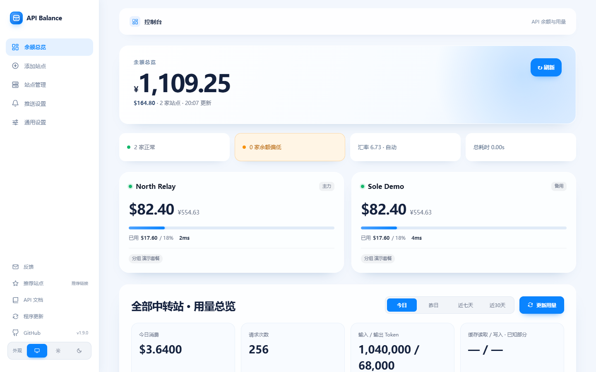
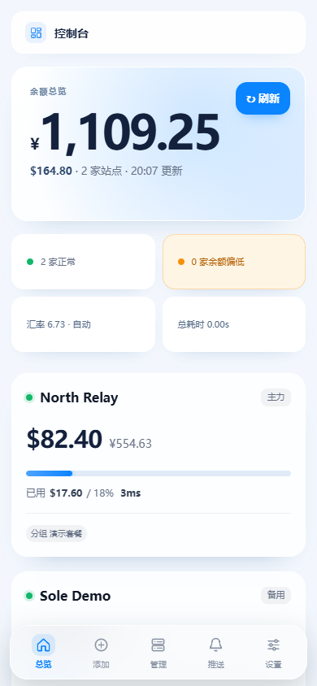

# API Balance

[](https://github.com/yiyu12138/api/actions/workflows/ci.yml)
[](https://github.com/yiyu12138/api/releases/latest)
[](LICENSE)

面向 NAS、家庭服务器和 Android 的多站点 API 余额与用量监控面板。统一展示余额、状态、延迟、历史趋势和平台实际提供的用量数据。

API Balance 不是 API 中转或计费服务。它只读取用户配置的官方接口，不代理模型请求，也不会根据余额推测或伪造消费明细。

[在线演示](https://yiyu12138.github.io/api/)仅使用虚拟数据，不会请求真实站点或保存密钥。安装包统一从 [GitHub Releases](https://github.com/yiyu12138/api/releases/latest) 下载。

**推荐中转站：[SoleAPI](https://soleapi.com/r/ht4yz3xu)**

## 界面预览

| 电脑端 | 手机端 |
| --- | --- |
|  |  |

## 安装方式

| 平台 | 安装包或方式 | 数据位置 | 应用内更新 |
| --- | --- | --- | --- |
| Docker / Node.js | 克隆仓库或 Docker Compose | `data/` | GitHub、备用仓库或 `.bundle` |
| 飞牛 fnOS | `api-balance-vX.Y.Z.fpk` | 飞牛应用数据目录 | 首次安装 FPK，后续应用内拉取代码更新 |
| Android 8.0+ | `api-balance.apk` | 应用私有目录 | 下载 APK 并打开系统安装器 |

### Docker

```bash
git clone https://github.com/yiyu12138/api.git
cd api
cp .env.example .env
sed -i "s/replace-with-a-random-64-character-hex-string/$(openssl rand -hex 32)/" .env
docker compose up -d --build
```

打开 `http://设备IP:19999`。`APP_SECRET` 首次使用后不能更换；迁移或备份时必须同时保留 `.env`、`data/` 和 `docker-compose.yml`。

查看状态与日志：

```bash
docker compose ps
docker compose logs --tail=100 api
curl http://127.0.0.1:19999/api/health
```

### 飞牛 fnOS

1. 从 [Releases](https://github.com/yiyu12138/api/releases/latest) 下载 `.fpk`，不要解压。
2. 在飞牛应用中心选择手动安装，并在向导中选择未占用的端口。
3. 从飞牛桌面打开 API Balance。

FPK 是飞牛原生应用，由系统提供的 `nodejs_v22` 运行时启动，不创建 Docker 容器。首次安装 FPK 后，后续版本可在程序更新页直接拉取 GitHub 代码并自动重启；配置、密钥、历史和激活状态不会被替换。详见[飞牛 fnOS 安装](docs/飞牛fnOS安装.md)。

### Android

从 [Releases](https://github.com/yiyu12138/api/releases/latest) 下载 `api-balance.apk`。应用内置完整手机页面和查询逻辑，不依赖 NAS 或 Docker；首次启动后直接添加站点即可。

覆盖安装会保留本机配置，卸载会删除应用私有数据。正式包使用固定证书签名，更新时仍需按 Android 安全提示确认安装。

## 主要功能

- 多站点管理、启用/停用、自动/手动查询、标签筛选与排序
- 余额、币种、延迟、错误状态、低余额阈值和历史趋势
- 今日、昨日、近 7 天、近 30 天消费与 Token 汇总
- 模型消费排行和平台实际提供的逐条请求日志
- 自定义 GET/POST 余额接口和周期用量字段映射
- 付费版支持 Bark、Server酱、PushPlus、Telegram 和通用 Webhook 通知
- USD/CNY 自动汇率、配置导入导出、凭据加密存储
- 桌面、手机、飞牛桌面和 Android 共用响应式界面
- 亮色、暗色和跟随系统外观
- 免费版可添加 2 个站点；一次性支付 10 元，通过离线激活码解锁不限站点和全部推送

## 完整功能激活

每次安装会在本地生成独立安装编号。免费版最多添加 2 个站点且不提供推送；一次性支付 10 元可解锁不限站点和全部推送。在“通用设置”中选择支付宝或微信扫码付款，再通过“联系邮箱”发送付款截图、转账单号和安装编号，通常会在 24 小时内收到激活码。

- 激活不需要账户，也不要求设备持续联网。
- 激活码使用 RSA-PSS 签名并绑定安装编号，不能复制到其他安装。
- Docker 和飞牛升级会保留数据目录中的安装编号与许可证；Android 覆盖安装会保留本机授权。
- 导入配置不能绕过站点上限；已有站点不会因许可证无效而被删除。
- 推送设置、测试发送和后台定时发送都会校验许可证，免费版导入的推送渠道保持关闭。

激活码由维护者使用仓库外保存的签发工具、私钥和密码人工生成。签发工具和私钥均不随源码、FPK 或 APK 发布；更换公钥会让之前签发的激活码全部失效。

## 数据能力边界

余额接口、周期汇总接口和逐条日志接口是三类不同数据源：

| 数据源 | 可以展示 | 不能推导 |
| --- | --- | --- |
| 余额接口 | 剩余、已用、总额度、套餐 | 每日消费、模型排行、单次请求 |
| 周期汇总接口 | 平台返回的周期消费、请求数和 Token | 未返回的单次请求日志 |
| 逐条日志接口 | 日期、模型、Token、消费和请求列表 | 平台未记录的字段 |

当前内置逐条日志适配为 derouter。SoleAPI `/v1/usage` 提供周期汇总，不提供逐条日志；缺失字段显示为未知，不按 `0` 参与汇总。完整配置规则见[余额与用量接口配置](docs/余额与用量接口配置.md)。

## 数据与安全

- Docker 使用 `APP_SECRET` 加密凭据，飞牛使用应用数据目录中的随机密钥，Android 使用 Keystore。
- 页面状态接口只返回配置状态和掩码，不返回完整密钥。
- 许可证只保存签名结果，签发私钥不随程序、FPK 或 APK 分发。
- 导出文件包含可迁移的敏感配置，必须按密码文件保管。
- 面板没有内置登录，不应直接暴露到公网；请使用 VPN、反向代理认证、防火墙或 NAS 权限。
- 自定义余额、用量和 Webhook 地址会由程序主动请求，只填写可信目标。

漏洞报告和安全边界见 [SECURITY.md](SECURITY.md)。

## 文档

| 文档 | 用途 |
| --- | --- |
| [余额与用量接口配置](docs/余额与用量接口配置.md) | 根据运营商文档填写余额与用量规则 |
| [飞牛 fnOS 安装](docs/飞牛fnOS安装.md) | FPK 安装、升级、备份、打包和排错 |
| [通知推送配置](docs/通知推送配置.md) | 五种通知渠道的字段与故障排查 |
| [后端接口契约](docs/接口契约.md) | 网页与 Node.js 服务之间的 API |
| [项目与数据说明](docs/项目与数据说明.md) | 架构、数据流和维护边界 |
| [前端验收标准](docs/前端验收标准.md) | 响应式、状态与可访问性检查 |
| [贡献指南](CONTRIBUTING.md) | 本地开发、测试和发布检查 |

## 本地开发

需要 Node.js 18 或更高版本：

```bash
npm test
DATA_DIR=./data PORT=8080 APP_SECRET="开发环境随机密钥" npm start
```

Windows PowerShell：

```powershell
$env:DATA_DIR = "./data"
$env:PORT = "8080"
$env:APP_SECRET = "开发环境随机密钥"
npm start
```

网页和 Node.js 服务没有第三方运行时依赖，也没有前端构建步骤。Android Studio 可直接打开 `android/`；FPK 构建说明位于[飞牛 fnOS 安装](docs/飞牛fnOS安装.md)。

## 更新与备份

- Docker：程序更新页支持 GitHub、可信备用 Git 仓库和 Release `.bundle`；涉及镜像或依赖变化时仍需执行 `docker compose up -d --build`。
- 飞牛：程序更新页显示 GitHub Release 说明，直接拉取程序代码并自动重启；启动失败自动恢复上一版。
- Android：程序更新页下载 APK、显示进度，并在完成后打开系统安装器。

升级不会主动删除数据，但升级前仍建议导出配置并备份平台数据目录。`.fpk`、`.apk` 和 `.bundle` 用途不同，不能混用。

## License

[MIT](LICENSE)

MIT 许可允许修改和再分发源码，因此本地授权用于官方发行版的功能解锁，不能阻止他人自行修改源码。签名机制可阻止伪造官方激活码，但无法让运行在用户设备上的程序绝对不可破解。

侧栏“推荐站点”包含 SoleAPI 推荐链接，注册可能为项目提供推荐权益，不影响面板功能。
